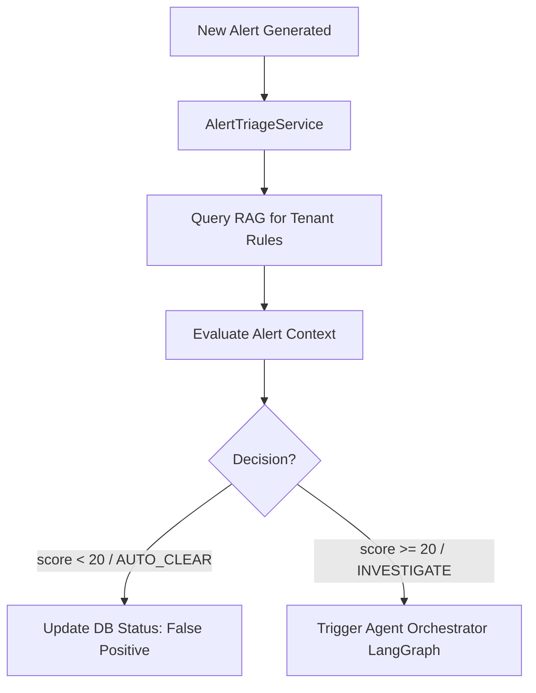

# BE-205: Alert Triage & Prioritisation — Architecture & Implementation Plan

**Date:** 2026-05-27
**Status:** DRAFT
**Author:** AI Architect

## 1. Context & Objective

Running autonomous agentic investigations is compute-intensive and costly. In a real-world transaction monitoring environment, 80-90% of incoming alerts are high-volume, low-risk false positives (e.g. standard payments matching basic threshold rules).

`BE-205` introduces an **Alert Triage & Prioritisation** pipeline. This acts as a pre-filtering layer before alert investigations. It:
1. Receives an incoming `Alert`.
2. Queries the RAG Pipeline for dynamic compliance policies and false-positive criteria (e.g. AUSTRAC/NZ FIU guidance on legitimate structuring).
3. Auto-scores the alert using a fast, low-temperature prompt.
4. Auto-clears low-risk false positives instantly, reserving full LangGraph reasoning only for suspicious patterns.

---

## 2. Technical Approach: RAG-Powered Pre-Filtering

We will implement a standalone service, `AlertTriageService`, that executes before triggering the full Agent Orchestrator.

### 2.1 Triage Schema
The triage step outputs a structured rating:
```python
class TriageResult(BaseModel):
    score: int  # 0 to 100
    decision: str  # "AUTO_CLEAR" | "INVESTIGATE"
    rationale: str
```

### 2.2 Ingestion & Filtering Workflow


---

## 3. Step-by-Step Implementation Roadmap

### Step 1: Create Triage Service
* **File:** `src/aml/services/triage/service.py`
* Implement `AlertTriageService` with `triage_alert(alert: Alert) -> TriageResult`:
  * Embed alert title/description and query the `RAGService` to retrieve relevant regulatory or local tenant rules.
  * Construct a strict structured LLM prompt injecting the alert details and RAG context.
  * Instruct the LLM to output valid JSON matching `TriageResult`.

### Step 2: Integrate Triage into API Router
* **File:** `src/aml/api/routers/agents.py`
* In `investigate_alert` endpoint:
  * First, execute `triage_service.triage_alert(alert)`.
  * If the result is `AUTO_CLEAR`:
    * Update `alert.status` to `FALSE_POSITIVE` or `RESOLVED`.
    * Save triage details in `alert.details["triage"]`.
    * Immediately return the response, skipping LangGraph, saving time and tokens.
  * If the result is `INVESTIGATE`:
    * Update `alert.details["triage"]` with the triage priority score.
    * Proceed to execute `build_orchestrator().ainvoke(...)`.

### Step 3: Implement Unit & Integration Tests
* **File:** `tests/test_alert_triage.py`
* Mock both RAG context retrieval and LLM triage responses.
* Test edge cases:
  * Low-risk alert $\rightarrow$ auto-clears.
  * High-risk alert $\rightarrow$ triggers agent.
  * Dynamic tenant-policy context isolation.
